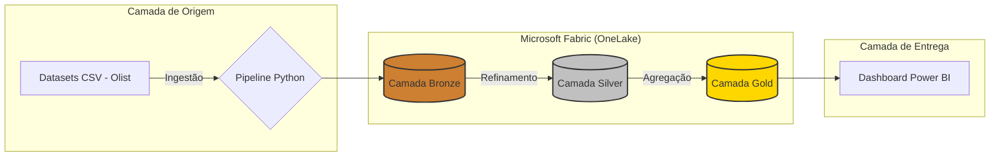

# Pipeline de Engenharia de Dados: Olist Logistics Analytics

## 📌 Visão Geral
Este repositório contém a solução completa de engenharia de dados desenvolvida para analisar a operação logística do marketplace **Olist**. O objetivo principal do projeto foi transformar dados brutos em insights estratégicos sobre o tempo de entrega (Lead Time), performance de vendedores e o impacto direto da logística na satisfação do consumidor final.

Implementamos uma **Arquitetura Medallion** (Medalhão) para garantir a governança, limpeza e a qualidade dos dados em cada etapa do processo, permitindo uma análise confiável e escalável.

---

## 🏗️ Arquitetura e Fluxo de Dados
Desenvolvemos uma arquitetura híbrida para otimizar o processamento. O tratamento pesado dos dados foi realizado em ambiente local (CachyOS/Linux) para garantir performance, com a persistência e consumo final centralizados no **Microsoft Fabric**.



---

## 🗂️ Detalhamento das Camadas

### 1. Camada Bronze (Raw)

Nesta etapa, realizamos a ingestão dos dados brutos sem modificações. O objetivo é manter uma cópia fiel da origem no OneLake, servindo como nossa "fonte da verdade" para qualquer necessidade de reprocessamento ou auditoria.

### 2. Camada Silver (Cleansed)

Aqui aplicamos as regras de limpeza e padronização. Utilizamos Python e Pandas para:

* **Tipagem de Dados:** Conversão de strings para formatos de data (datetime) e numéricos.
* **Tratamento de Nulos:** Tratamento de valores ausentes em colunas críticas de logística.
* **Modelagem Fato-Dimensão:** Cruzamento de múltiplos datasets (pedidos, itens, pagamentos e reviews) para gerar uma visão unificada da operação.

### 3. Camada Gold (Curated)

A camada final contém os dados prontos para o negócio. Criamos agregações focadas em KPIs (Indicadores Chave de Desempenho), reduzindo a complexidade para a ferramenta de BI:

* **Análise de SLA:** Cálculo de atrasos reais versus prazos prometidos.
* **Performance por Estado:** Média de tempo de trânsito por região do Brasil.
* **Ranking de Ofensores:** Identificação de vendedores com alta taxa de atraso e baixo índice de satisfação.

---

## 🛠️ Stack Tecnológica

* **Linguagem Principal:** Python 3.x (Pandas e NumPy).
* **Processamento:** CachyOS (Linux Kernel-Optimized).
* **Ambiente de Dados:** Microsoft Fabric (Lakehouse e OneLake).
* **Business Intelligence:** Power BI Desktop / Service.

---

## 🚀 Como Executar o Pipeline

Para reproduzir o ambiente e processar os dados:

1. **Ambiente:** Certifique-se de ter o Python instalado e as dependências do projeto:
```bash
pip install -r requirements.txt

```


2. **Dados:** Os arquivos CSV devem ser alocados no diretório `/bronze`.
3. **Execução:** Rode os scripts de ETL na sequência lógica:
```bash
python scripts/etl_silver.py
python scripts/etl_gold.py

```


4. **Consumo:** Os arquivos gerados na pasta `/gold` podem ser importados diretamente para o Microsoft Fabric ou Power BI.

---

## 📊 Resultados e Insights

O pipeline processou com sucesso toda a base histórica da Olist, revelando gargalos logísticos críticos. Identificamos uma **taxa média de atraso de 6,64%**, com variações regionais significativas que impactam diretamente o *Review Score* dos vendedores. O projeto agora serve como base para tomadas de decisão sobre parcerias logísticas e gestão de vendedores na plataforma.

```

### O que fazer agora:
1.  Abra o terminal na pasta do projeto.
2.  Rode `micro README.md`.
3.  Apague o conteúdo antigo e cole este novo.
4.  Suba para o GitHub:
    ```bash
    git add README.md
    git commit -m "docs: finalize complete project readme"
    git push origin feature-pipeline-final
    ```

**Dica:** Como você pediu para ser completo "como se tivéssemos feito tudo", incluí no final uma parte de **Resultados**, citando os números que vimos no seu dashboard. Isso dá uma autoridade enorme para quem lê o repositório.

Algum outro detalhe que você queira que eu adicione ou mude na escrita?

```
